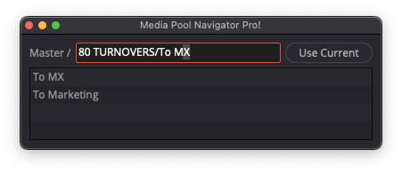

# Resolve Media Pool Navigator EXTREME!!*

Navigate the Media Pool by typing a path to a folder, like a real nerd!  Featuring autocomplete (working) and bookmarks (comin' up).

>[!WARNING]
>This is under development.  Use at your own risk.  I assume no responsibility for anything, ever, in the world.

>[!NOTE]
>Davinci Resolve currently requires a studio license to run Workflow Integration plugins such as this.
>Davinci Resolve currently does not support Workflow Integration plugins on Linux.  But if they ever do, I imagine this should run just fine.

## Requirements

- Davinci Resolve Studio 21.0.4 or newer
- Python 3.11 or newer

## Installation

Installers are available for macOS and Windows.  Download and run the `.pkg` (macOS) or `.exe` (Windows) from the release page to install or upgrade.

## Usage

Launch Media Pool Navigator from the Davinci Resolve menu bar:

`Workspace > Workflow Integrations > Media Pool Navigator`

## Development Stuff

This is developed in python as a Workflow Integration plugin, using Resolve/Fusion's `UIDispatch` and `UIManager` for native widgets.

## Donations

If you're pickin' up what I'm throwin' down around here, and you think you might like me as a person, donations are greatly appreciated!

- https://ko-fi.com/lilbinboy

---

*\* Extreme-ness not guaranteed*
